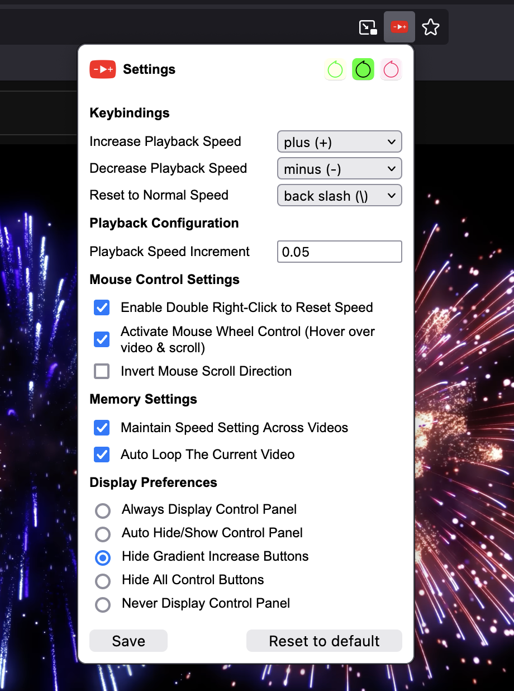
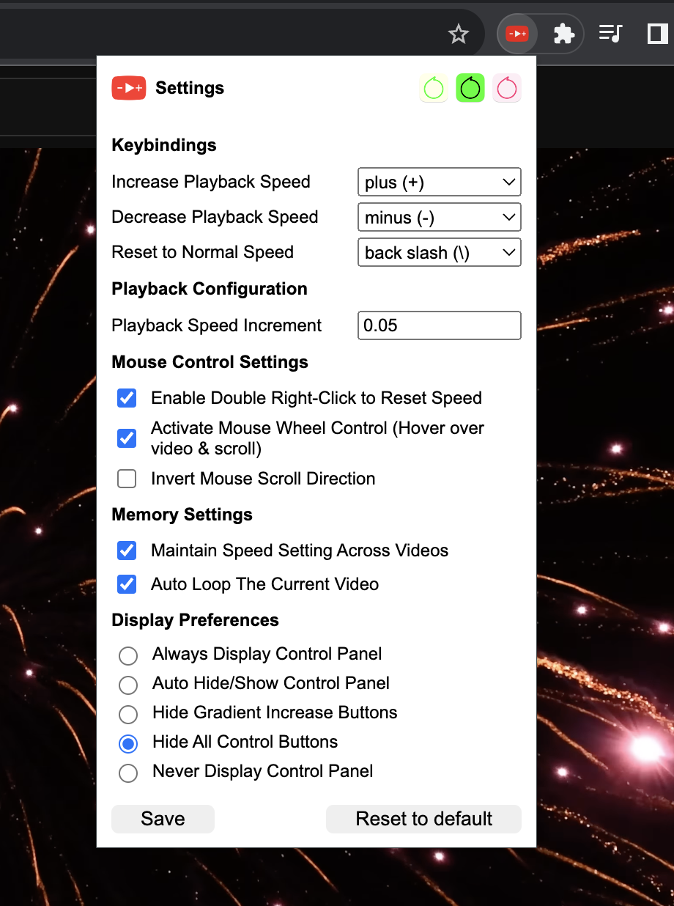
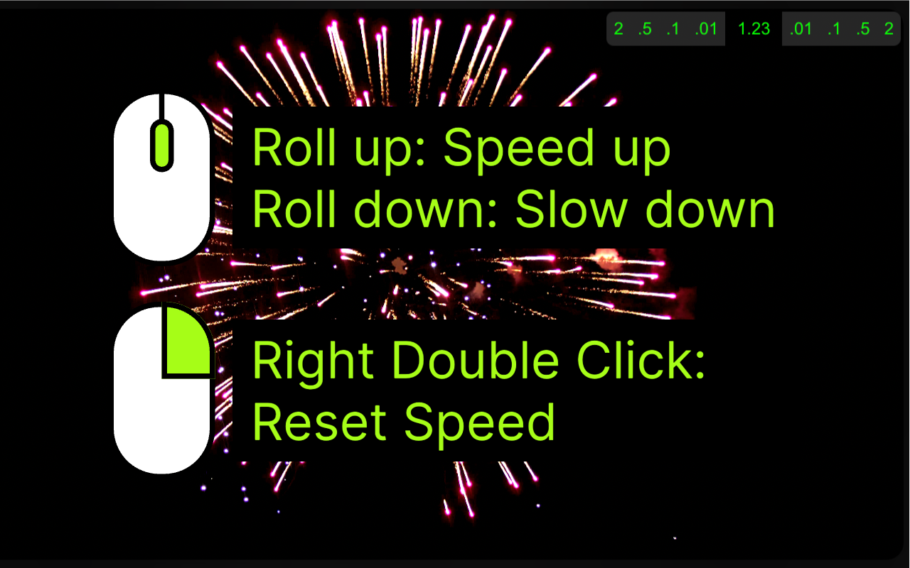
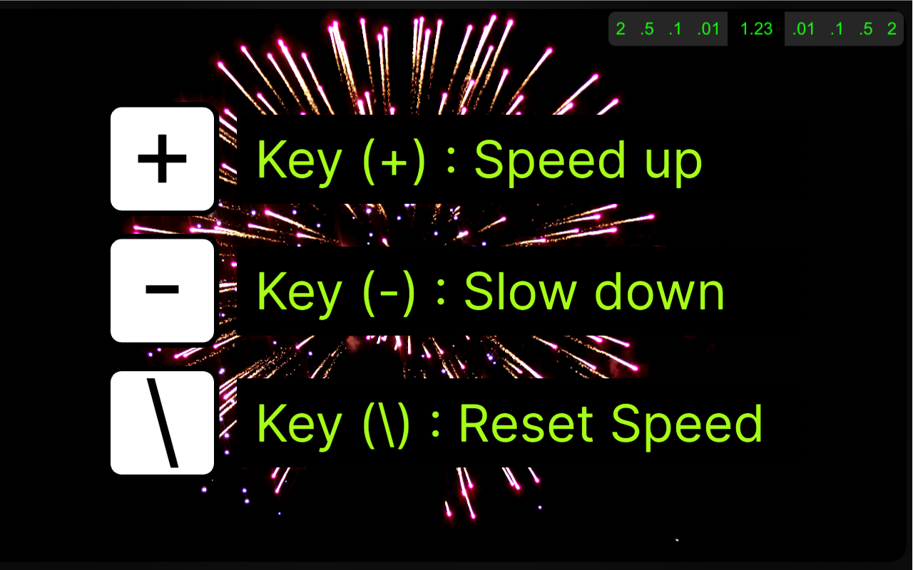
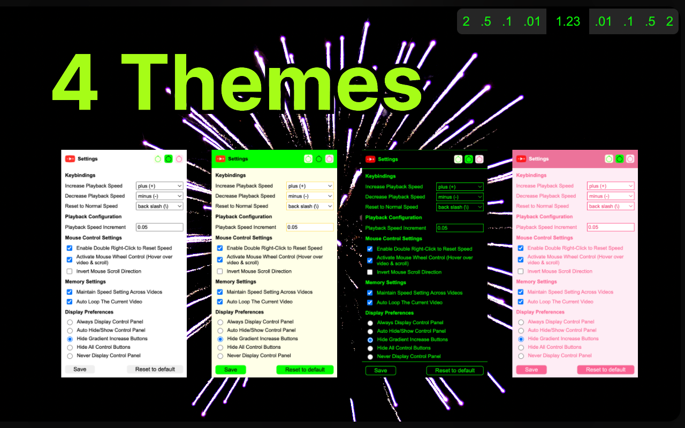

 [☞ English (英文)](https://github.com/aynorway/ay-youtube-speed-controller/blob/master/README.md)&nbsp;&nbsp;&nbsp;&nbsp;&nbsp;&nbsp;&nbsp;&nbsp;[☞ Chinese (中文)](https://github.com/aynorway/ay-youtube-speed-controller/blob/master/README_cn.md)

---

# [网络视频-速度控制-插件扩展 (适用:谷歌浏览器&火狐浏览器)](https://github.com/aynorway/web-video-speed-controller)

此浏览器扩展允许用户轻松控制任何在线视频的播放速度。

---

大家好，我是Adrian Y，“老6”。这是我用闲暇时间完成的一个功能强大的浏览器扩展，允许用户自由控制几乎所有在线视频的播放速度，完美适配 YouTube。不仅适用于特定的视频服务，还适用于几乎所有使用标准视频播放器的网站，如Vimeo，Bilibili，Youku等。适用于对调节播放视频速度有高度需求的人，精度0.01倍速，最大16倍速。此扩展同时支持谷歌浏览器和火狐浏览器。目前免费提供给大家使用，希望能帮助到大家。 

本软件未使用开放源代码许可证，详情请点击[此处](JS_File_Disclosure_Explanation.md)查看原因。

## 使用界面 

|  |
|:--:| 
| YouTube 界面 |

|  |  |
|:--:|:--:| 
| Vimeo 界面 | Bilibili 界面 |

## 功能

1. 更改视频播放速度，增速、减速或重置为正常速度。
2. 支持自定义键盘快捷键。
3. 支持鼠标调节播放速度，鼠标悬停在视频上即可进行微调。
4. 支持用户自定义速度增长梯度。
5. 支持双击鼠标右键迅速回归原始速度。
6. 支持记忆视频播放完毕后，自动重新开始播放。
7. 支持记忆修改后的播放速度，并且应用到所有视频。
8. 视频上方操作面板实时显示当前播放速度。
9. 5种视频上方操作面板显示样式，包括隐藏。
10. 4种主题颜色。
11. 完美适配谷歌浏览器及火狐浏览器。

## 设置界面 

|  |  |
|:--:|:--:| 
| Firefox-浏览器-设置界面 | Chrome-浏览器-设置界面 |

## 使用指南

1. **安装扩展**：前往浏览器扩展商店，搜索并安装此扩展。
2. **观看视频**：访问任意在线视频网站并播放视频 (完美支持YouTube)。
3. **控制播放速度**：可通过悬浮控制面板按钮，或键盘快捷键,或鼠标调整播放速度。
4. **自定义设置**：点击扩展图标，或进入插件“选项”，如快捷键、鼠标行为等。

|  |  |
|:--:|:--:| 

|  |  |
|:--:|:--:| 

## 访问Firefox扩展商店进行下载

扩展名称：网络视频速度控制器  
适用于：Firefox浏览器  
下载链接：[点击此处访问Firefox扩展商店下载网络视频速度控制器](https://addons.mozilla.org/zh-CN/firefox/addon/web-video-speed-controller/)

## 建议和反馈

感谢您的支持与使用！如果在使用过程中遇到任何问题或有任何建议，欢迎联系我。
工作邮箱: [adrianyangbiz@gmail.com](adrianyangbiz@gmail.com)
